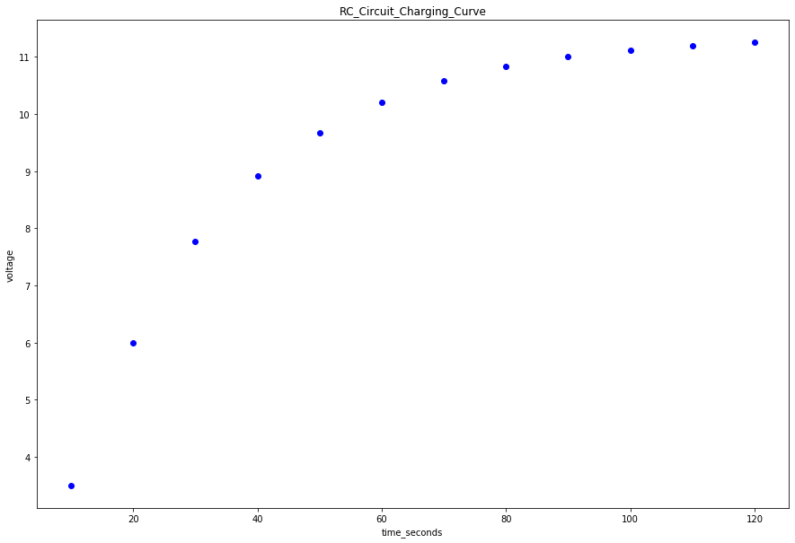

```python
from __future__ import division
import numpy as np
import matplotlib.pyplot as plt

#-------------------------------------------#
#Data Section - Create Arrays for data. Perform necessary calculations
#CHANGE THE VARIABLE NAMES and numbers to match your data
xvariable_changeme = np.array([10, 20, 30, 40, 50, 60, 70, 80, 90, 100, 110, 120]) #what are units?
yvariable_changeme = np.array([3.5, 6.0, 7.77, 8.91, 9.67, 10.21, 10.58, 10.83, 11.01, 11.12, 11.20, 11.25]) #what are units?


#--------------------------------------------#
#Re-assign variables as x, y, dy so that the following code may remain generic

x = xvariable_changeme   #this should be the array you want to plot on the x axis
y = yvariable_changeme

#-----------------------------------------------------------------------#
#Plot data on graph. Plot error bars and place values for slope, error in slope and goodness of fit on the plot using "annotate"
plt.figure(figsize=(15,10))
 
plt.scatter(x, y, color='blue', marker='o')
 
 
#create labels  YOU NEED TO CHANGE THESE!!!
plt.xlabel('time_seconds')
plt.ylabel('voltage')
plt.title('RC_Circuit_Charging_Curve')


plt.show()
```





```python

```


```python

```
